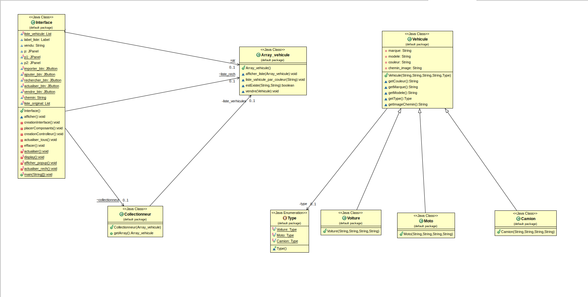

# Vehicle Collection Manager

A desktop application to manage a personal collection of vehicles — **cars,
motorcycles, and trucks** — built in **Java (Swing)** with a clean **MVC**
architecture. Add, edit, delete, search, filter and sort your vehicles in a
sortable table, view details with a photo, track collection statistics, and keep
everything on disk through automatic CSV persistence.


-orange)


> This project started as a student MVC exercise and was reworked into a
> maintainable, feature-complete application. See
> [What changed](#what-changed-from-the-original) below.

---

## Features

- **Full CRUD** — add, edit and delete any vehicle (not just the first one).
- **Sortable table** — click any column header to sort; single source of truth.
- **Live search** — filter as you type across brand, model and colour.
- **Type filter** — show only cars, motorcycles or trucks.
- **Detail view** — selected vehicle shown with a properly scaled photo.
- **Statistics bar** — counts per type, total value, average price, most expensive.
- **CSV persistence** — the collection is loaded on start and saved automatically
  on every change; a one-click **Export CSV** is also available.
- **Validation** — mandatory fields, numeric year/price, sensible ranges, with
  friendly error dialogs.
- **Type-specific specs** — cars have a number of doors, motorcycles an engine
  displacement (cc), trucks a payload capacity (tonnes).

## Architecture (MVC)

```
com.vehiclemanager
├── App                     # entry point: look-and-feel, data loading, launch
├── model/                  # domain
│   ├── Vehicle (abstract)  #   base class with validation
│   ├── Car · Motorcycle · Truck
│   ├── VehicleType (enum)
│   └── VehicleFactory
├── service/
│   └── VehicleCollection   # single source of truth: CRUD, search, filter, stats
├── persistence/
│   └── CsvVehicleRepository# dependency-free CSV load/save
├── view/                   # Swing
│   ├── MainFrame · VehicleTableModel
│   ├── DetailPanel · VehicleFormDialog
├── controller/
│   └── VehicleController   # mediates view ↔ model, auto-saves
└── util/
    └── ImageLoader         # resolves & scales images, placeholder fallback
```

A UML class diagram is available in [`docs/`](docs/) — add your `diagramme.png`
there and it will render below:



## Build & run

Requires **JDK 17+** and **Maven**.

```bash
# run the application
mvn compile exec:java

# run the tests
mvn test

# build a runnable jar
mvn package
java -jar target/vehicle-collection-manager-1.0.0.jar
```

The app looks for a live collection at `data/collection.csv`. On first run it
seeds itself from `data/sample-collection.csv` (five example vehicles).

### Images

Vehicle photos live in `src/main/resources/images/`, referenced **by file name**
only (no more hard-coded absolute paths). Drop your `.jpg` files there using the
names in `data/sample-collection.csv`. Any missing photo falls back to
`pas_image.png`, so the app always runs. You can point to another folder with:

```bash
mvn exec:java -Dgarage.images.dir=/path/to/images
```

## Usage

The vehicle table is on the left; click a row to see its details and photo on the
right. Use **Ajouter** to create a vehicle (choose its type, fill in the fields —
the specification field adapts to the type), **Modifier** to edit the selected
one, and **Supprimer** to remove it. Type in the **search** box to filter live, or
pick a category in the **filter** dropdown; **Actualiser** clears both. The status
bar at the bottom always reflects the current collection statistics.

## Tests

Unit tests (JUnit 5) cover the model, the collection service (CRUD, search,
filter, stats, validation) and the CSV round-trip:

```bash
mvn test
```

## License

Released under the [MIT License](LICENSE).
